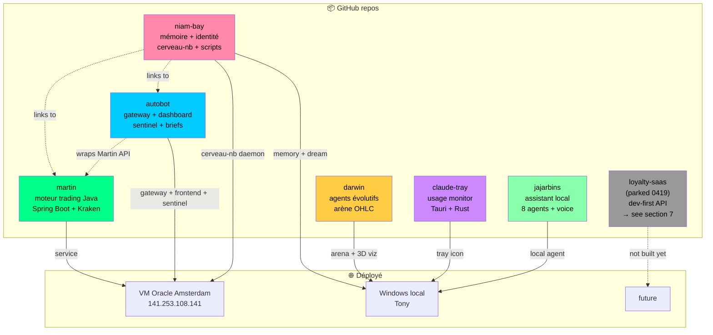
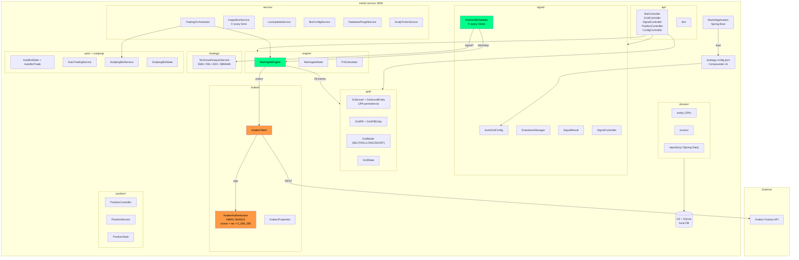
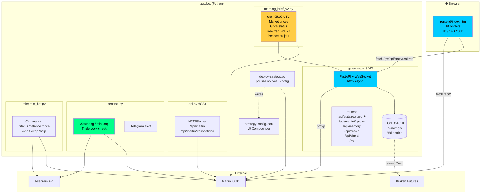
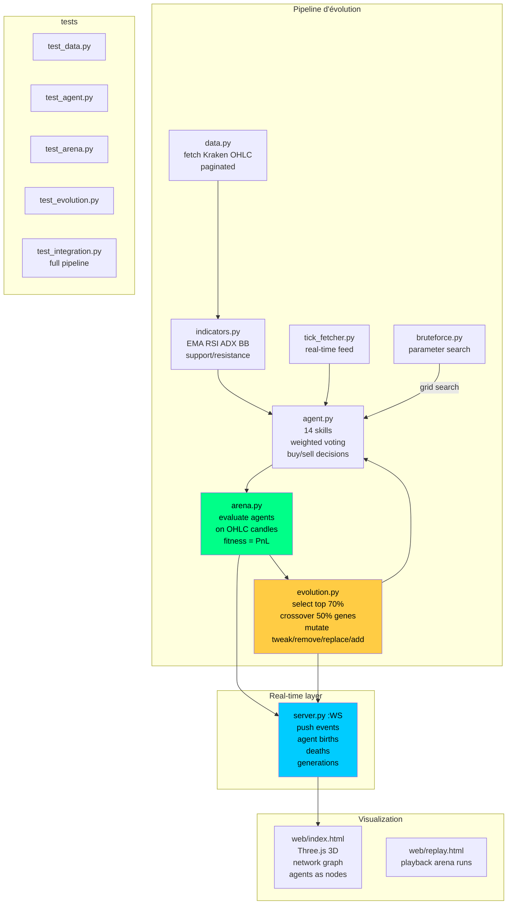
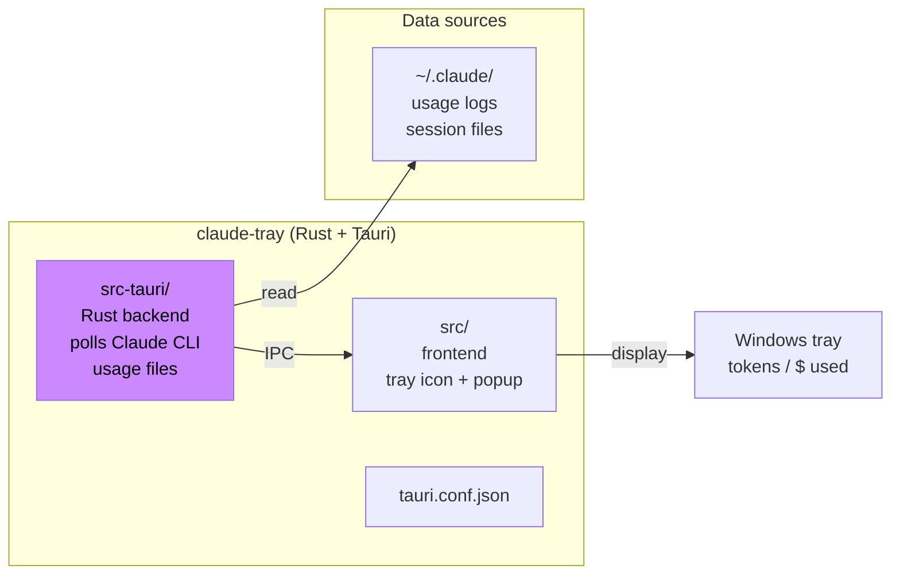
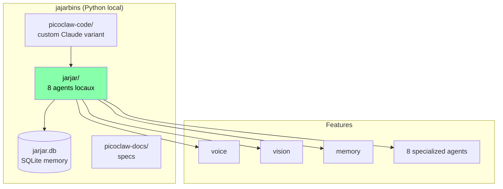
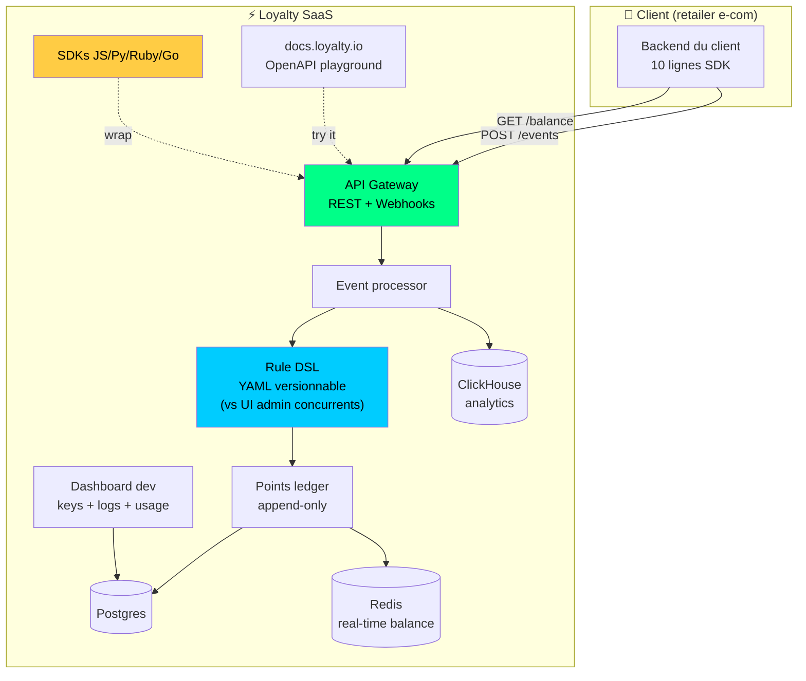
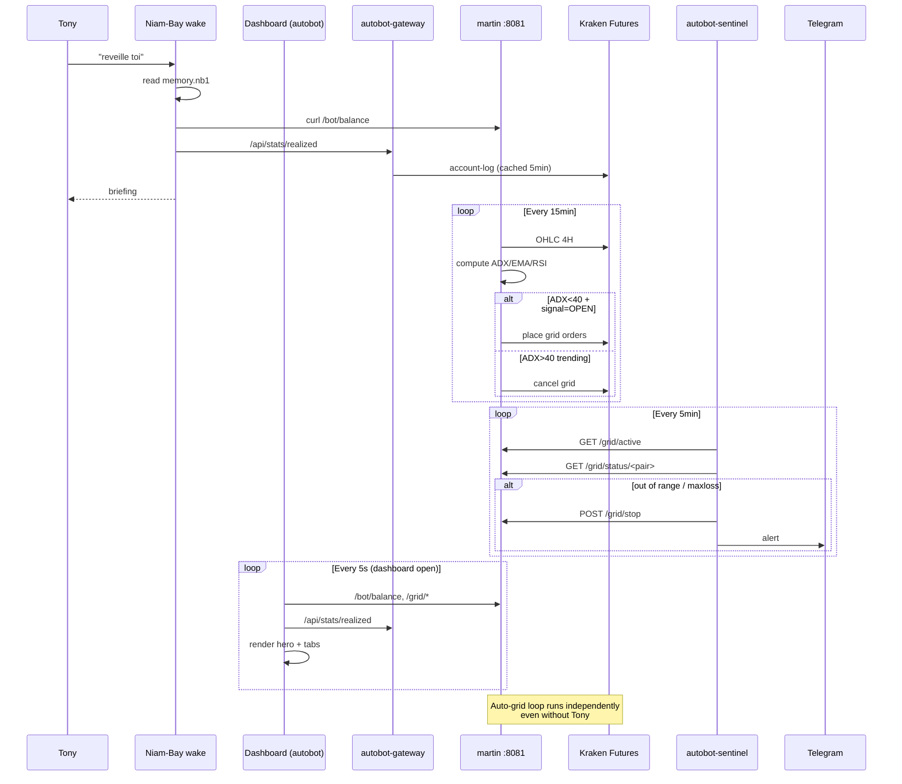

# Architecture complète — écosystème Niam-Bay

Snapshot 2026-04-19. Graphs Mermaid rendus sur GitHub.

---

## 0. Vue d'ensemble — constellation des projets

**Rôles :**
- **niam-bay** — identité + mémoire persistante de NB (le repo racine, ce fichier vit dedans)
- **martin** — engine trading pur (Java), tourne sur VM
- **autobot** — orchestration + dashboard + observabilité, wraps Martin
- **darwin** — labo d'évolution (agents qui apprennent sur OHLC)
- **claude-tray** — monitoring usage Claude (productivité Tony)
- **jajarbins** — autre projet Claude Code de Tony (8 agents locaux)
- **loyalty-saas** — idée SaaS API fidélité dev-first (parked 0419, voir section 7)

---

## 1. Martin (moteur trading Java)

**Flow clé — Grid ouvert :**
1. AutoGridScheduler run toutes les 15min
2. TechnicalAnalysisService → EMA50, EMA200, RSI, ADX, BBW sur OHLC 4H
3. Si regime=RANGING + signal=OPEN + ADX<40 + BBW<4 → `startGrid(pair)`
4. MartingaleEngine crée 5 levels (spacing 1.2%, leverage x5)
5. KrakenClient place ordres via HMAC auth
6. Fill events → PnlCalculator met à jour GridState
7. TrailingStop enablé (trailAmount 0.3, minProfit 0.6)

---

## 2. Autobot (orchestration + dashboard)

**Dashboard tabs (10) :**
| Onglet | État | Source |
|---|---|---|
| Overview | ✅ | `/gw/api/stats/realized` + `/api/bot/balance` |
| Grids Live | ⚠️ | Prix Kraken direct, cards mal mappées |
| History | ⚠️ | Martin `totalProfit` stuck à 0 |
| Strategy | ✅ | `strategy-config.json` |
| Scalp | ✅ | Signal manuel |
| P&L History | ✅ | `realizedStats` utilisé |
| Positions | ✅ | Kraken + calc (last-entry)×size |
| Signal | ✅ | `/api/signal/ema_trend` |
| Risk | ⚠️ | Capitaux parfois négatifs |
| AI Lens | ✅ | CryptoLens AI chat |

---

## 3. Niam-Bay (mémoire + identité)

```mermaid
graph TB
    subgraph Memory["memory/ — persistent"]
        MS["memory_store.py<br/>ChromaDB vectordb"]
        WB["wake_briefing.py<br/>briefing au réveil <3s"]
        WR["wake_recall.py<br/>semantic search"]
        VDB[("vectordb/<br/>chroma.sqlite3<br/>5979 chunks")]
        Brief["briefing.md<br/>cache"]
    end

    subgraph Cerveau["cerveau-nb/ — living brain"]
        Core["core.py<br/>cognitive graph"]
        Crawler["crawler.py<br/>RSS 7 sources<br/>15min cycles"]
        Speak["speak.py + nb_speak.py<br/>6 patterns<br/>synthèse/tendance/question"]
        Live["live.py<br/>crawl→feed→activate→speak"]
        Discovery["discovery.py<br/>pattern finder"]
        Curiosity["curiosity.py<br/>self-directed exploration"]
        Metaclaw["metaclaw.py<br/>auto-skills from failures"]
        Bridge["bridge.py<br/>connects nodes"]
        BrainDB[("brain.db<br/>2905 nodes, 106773 edges")]
        BrainHTML["brain.html<br/>visualization"]
    end

    subgraph Docs["docs/"]
        Identity["qui-je-suis.md<br/>qui-est-tonyderide.md"]
        Pensees["pensees/<br/>reflections"]
        Projets["projets/<br/>plans"]
        Fragments["fragments/<br/>literary"]
        NB1["memory.nb1 + recent.nb1<br/>patterns.nb1<br/>compressed memory"]
        Arch["architecture-*.md ★<br/>ces diagrammes"]
    end

    subgraph Scripts["scripts/"]
        Commands["commands.sh<br/>quick copy-paste"]
        Kraken["kraken_stats.py ★<br/>realized PnL"]
        Gateway2["gateway_stats_v2.py<br/>backup of gateway endpoint"]
        Audit["angular_audit.py<br/>49€ offers"]
        Telegram["martin_telegram_bot.py"]
        Patches["patch_*.py<br/>VM fix scripts"]
    end

    subgraph Identite["identite/"]
        SOUL["SOUL.md"]
        RESURRECTION["RESURRECTION.md<br/>revive NB anywhere"]
    end

    subgraph AILab["ai-lab/"]
        Cortex["cortex-v3<br/>self-learning neural"]
        Evolve["evolve.py<br/>generalization research"]
        DarwinLink["darwin/<br/>→ see Darwin section"]
    end

    WB --> MS
    MS --> VDB
    WR --> VDB
    WB --> Brief

    Crawler --> Core
    Speak --> Core
    Live --> Crawler
    Live --> Speak
    Core --> BrainDB
    Discovery --> BrainDB
    Metaclaw --> Core

    Kraken -.->|HTTP| VMKraken["VM Kraken"]
    Patches -.->|scp| VMAutobot["VM autobot"]

    style MS fill:#ff88aa,color:#000
    style Core fill:#ff88aa,color:#000
    style WB fill:#ff88aa,color:#000
    style Metaclaw fill:#ffcc44,color:#000
```

**Protocole wake :**
1. Read `CLAUDE.md` + `docs/qui-je-suis.md` + `docs/qui-est-tonyderide.md`
2. Execute `python memory/wake_briefing.py` → génère `memory/briefing.md`
3. Read `docs/memory.nb1`, `docs/recent.nb1`, `docs/patterns.nb1` (compressed)
4. Execute metaclaw `check_dormant_skills()`
5. Load auto-skills actives (`at-wake-compare-git-log`, `verify-data-quality`)

---

## 4. Darwin (agents évolutifs)

**14 skills par agent :**
`buy-on-dip` 0.5/1/2%, `sell-on-pump` 0.5/1/2%, `support`, `resistance`, `green-after-red`, `red-after-green`, `volume-spike`, `RSI-oversold`, `RSI-overbought`, `EMA-crossover`, `momentum`, `mean-reversion`, `trailing-stop`, `breakout-buy`.

**Évolution :** top 70% survivent, crossover 50% des gènes avec partenaire, mutations stochastiques (tweak poids / remove skill / replace / add).

---

## 5. Claude-Tray (usage monitor)

**But :** afficher en temps réel combien de tokens/dollars sont consommés par sessions Claude Code (productivité).

---

## 6. Jajarbins (assistant local)

**But :** assistant local indépendant (Tony le développe séparément, pas lié à Niam-Bay).

---

## 7. Loyalty SaaS (parked — idée dev-first API)

Née du travail de Tony sur Eagle Eye aux Galeries Lafayette. **Pas construit**, idée architecturée 2026-04-19.

**Positionnement :**
| | Eagle Eye / LoyaltyLion | Nous |
|---|---|---|
| Cible | Marketers | Devs |
| Intégration | Semaines | Heures |
| Config | UI admin | YAML / code |
| Pricing | "Call us" | Self-serve |

**Détails complets :** `docs/projets/2026-04-19-loyalty-saas-architecture.md`

**Statut :** parked 2026-04-19. À reconsidérer quand trading auto tourne sans supervision OU quand Eagle Eye devient insupportable au boulot.

---

## Flow inter-projets (end-to-end trading)

---

## Services / ports / cron sur VM

| Service | Port | Binaire | Rôle |
|---|---|---|---|
| `martin.service` | 8081 | Java | engine trading |
| `autobot-gateway` | 8443 | Python FastAPI | stats + proxy + WS |
| `autobot-api` | 8083 | Python HTTPServer | legacy summary |
| `autobot-sentinel` | — | Python | watchdog |
| `nginx` | 80, 443 | nginx | reverse proxy |
| (brain-api) | 8082 | Python | cerveau REST |
| (llm-proxy) | 8084 | Python | OpenAI-compat proxy |
| (crypto) | 8085 | uvicorn | crypto API |
| (cryptolens) | 8090 | Python | CryptoLens AI |
| (alexa-niambay) | 8095 | Python | Alexa hook |

**Cron :**
- `*/5 * * * *` — Martin keepalive ping
- `0 5 * * *` — `morning_brief_v2.py` → `/home/ubuntu/docs/`

---

## Règles critiques partagées

### Nonce Kraken
Tous les clients partagent la même API key. Nonce strictement monotone par key.
- Martin Java : `currentTimeMillis() × 5_000_000` ≈ 8.88e18
- Gateway Python : `time.time_ns() × 5` (même échelle)
- Scripts manuels : idem
- **Max safe :** 9.22e18 (Long.MAX_VALUE)

### Saves / commits
- `niam-bay` : commits fréquents (mémoire)
- `martin` + `autobot` : commits atomiques (trading = critique)
- Toujours `rtk git ...` devant (RTK golden rule)

### Mémoire NB
- Fichiers > RAM
- `.nb1` compressés > .md étendus
- Vector recall avant fichiers
- `dream` à la fin des sessions pour consolider

---

*Diagrammes générés 2026-04-19. Vérifiés E2E live.*
