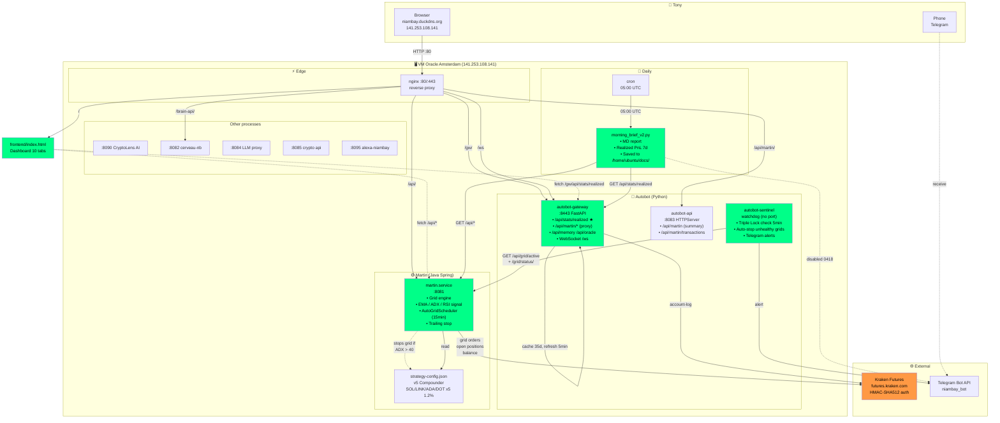

# Architecture Martin + Autobot

Snapshot — 2026-04-19 00:40 UTC. Vérifié E2E.

## Vue d'ensemble



## État actuel (vérifié 00:40 UTC)

### Services (tous actifs)

| Service | Port | Since | Status |
|---|---|---|---|
| `martin.service` | 8081 | 2026-04-18 21:39 | ✅ active |
| `autobot-api.service` | 8083 | 2026-04-05 13:59 | ✅ active |
| `autobot-gateway.service` | 8443 | 2026-04-18 22:02 | ✅ active |
| `autobot-sentinel.service` | (wd) | 2026-04-18 22:35 | ✅ active (réparé) |
| `nginx` | 80, 443 | 2026-03-27 02:46 | ✅ active |

### Trading live

| Grille | Capital | SL trigger | uPnL |
|---|---|---|---|
| PF_LINKUSD | $29 | $9.128 | -$0.95 |
| PF_DOTUSD | $25 | $1.225 | -$0.26 |
| PF_SOLUSD | $35 | $83.93 | -$0.88 |
| PF_ADAUSD | $29 | $0.24248 | -$1.19 |
| **Total** | **$118** | 4/4 reduceOnly | **-$3.28** |

- Portfolio : **$167.34** / Balance : **$170.46** / Available : **$126.04**
- Realized PnL 7d : **+$10.01** (127 trades, 4 pairs)
- 20 ordres grid + 4 stop-loss posés sur Kraken

### Flux de données

#### Trading loop (Martin autonome)
```
Every 15min:
  AutoGridScheduler
    → SignalService (EMA_TREND / Triple Lock)
    → pour chaque pair :
        si regime=RANGING + signal=OPEN + ADX<40 + BBW<4
          → ouvrir grid
        si regime=TRENDING + ADX>40
          → fermer grid
```

#### Dashboard live (Frontend)
```
Every 5s:
  frontend/index.html
    → fetch /api/bot/balance (via nginx → Martin :8081)
    → fetch /api/grid/active
    → fetch /api/grid/status/{pair} × 4
    → fetch /gw/api/stats/realized (via nginx → Gateway :8443)
        Gateway:
          → cache (in-memory 35d log entries)
          → refresh every 5min avec /account-log?from=max_id+1
          → filter by since param (7d / 14d / 30d)
    → updatePnL(net), updateGrids, updatePositions
```

#### Morning brief (Daily)
```
05:00 UTC cron:
  morning_brief_v2.py
    → GET /api/bot/balance
    → GET /api/grid/active + /grid/status × 4
    → GET /api/stats/realized (7d PnL)
    → GET /api/signal/ema_trend
    → write /home/ubuntu/docs/morning_brief_YYYYMMDD.md
```

#### Sentinel (Watchdog)
```
Every 5min:
  sentinel.py
    → fetch Kraken OHLC (ETH, SOL, DOT)
    → compute Triple Lock (EMA200, ADX, BBW)
    → check Martin /grid/active + /grid/status
    → si out-of-range ou maxloss proche → auto-stop + Telegram alert
    → append to /home/ubuntu/niam-bay-channel.md
```

## Nonce Kraken (important)

- **Problème résolu le 18/04** : scripts gateway et Martin partagent la même API key. Nonce = monotonic per key.
- **Solution** :
  - Martin Java : `currentTimeMillis() × 5_000_000` ≈ 8.88e18 (Long.MAX = 9.22e18)
  - Gateway Python : `time.time_ns() × 5` = même échelle
  - Scripts manuels : `time.time_ns() × 5`
- **Règle** : tout script qui utilise cette API key DOIT utiliser nonce ≥ `time.time_ns() × 5`

## Backups sur la VM

- `~/martin/backend.jar.bak-20260418_*`
- `~/autobot/gateway.py.bak.*`
- `~/autobot/frontend/index.html.bak.*`

## Repos GitHub

- **tonyderide/autobot** — gateway, frontend, sentinel, api, morning_brief, strategy
- **tonyderide/martin** — Java Spring Boot, Kraken integration
- **tonyderide/niam-bay** — mémoire, scripts, docs

## Points d'attention (futurs)

- ⚠️ ADX 44-48 toujours trending sur alts → grids peuvent se re-stopper
- ⚠️ Port 8095 (`alexa-niambay.py`) répond en erreur sur nginx `/` de duckdns — pas critique, tous les accès vont via l'IP directe
- ⚠️ `morning_brief.py` v1 désactivé (cron supprimé) — v2 est la bonne
- ⚠️ Volet "Active Grids Summary" du dashboard affiche `+$0.00` par grid (source = Martin `totalProfit` stuck à 0) — cosmétique
- ⚠️ Grids Live cards : valeurs bizarres dans certains champs (mauvais mapping) — cosmétique

## Commits session 0418

- `autobot` : 4 commits (stats endpoint, frontend 7/14/30D, sentinel fix, morning brief)
- `martin` : 1 commit (nonce multiplier)
- `niam-bay` : 1 commit (kraken_stats.py + scripts)
