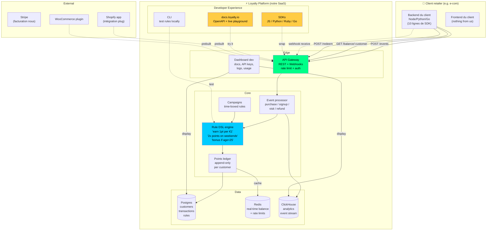

# Loyalty SaaS — dev-first API

Parked 2026-04-19. Né du travail de Tony sur Eagle Eye aux Galeries Lafayette.

**Thèse :** au lieu de vendre à des retail marketers (Eagle Eye classique), vendre à des **devs** qui intègrent une API fidélité en 10 lignes — comme Stripe l'a fait pour les paiements.

## Architecture cible



## Rule DSL — exemple

Le vrai différenciateur : une DSL que les devs aiment écrire.

```yaml
rule: weekend-double-points
when:
  event: purchase
  day_of_week: [saturday, sunday]
then:
  award_points: "{{ amount * 2 }}"
  to: "{{ customer_id }}"

rule: birthday-bonus
when:
  event: purchase
  customer.birthday_month: "{{ current_month }}"
then:
  award_points: "{{ amount * 3 }}"
  tag: "birthday_2026"
```

**Concurrents font :** UI drag-and-drop avec 47 onglets pour configurer la même chose. **Nous :** YAML versionnable avec CI/CD, code review des règles marketing via PR.

## Parcours dev — 10 lignes promise

```javascript
import { Loyalty } from '@loyalty/sdk';
const client = new Loyalty({ apiKey: process.env.LOYALTY_KEY });

// À chaque checkout
await client.events.create({
  type: 'purchase',
  customer: 'user_123',
  amount: 49.99,
  metadata: { items: [...] }
});

// Afficher le solde
const { balance } = await client.customers.get('user_123');
```

## Pricing teaser

| Plan | Prix | Cible |
|---|---|---|
| Free | $0 | <1k events/mois, 1 rule |
| Starter | $29/mo | 10k events, 5 rules, webhooks |
| Scale | $199/mo | 100k events, DSL avancée, SLA |
| Enterprise | custom | volume + SSO + dedicated |

Révenu-par-event ~ Stripe pricing : simple, prévisible, aligné avec la valeur.

## Stack technique proposé

- **API** : Go ou Rust (latence < 50ms p99)
- **Rule engine** : Starlark (Python-like, sandboxed) ou CEL
- **DB** : Postgres principal, ClickHouse events
- **Infra** : Fly.io ou AWS, edge-deployed
- **SDKs** : générés depuis OpenAPI (speakeasy.com)
- **Dashboard** : Angular (Tony maîtrise) ou Next.js
- **Docs** : Mintlify ou custom

## Positionnement vs concurrents

| | Eagle Eye / LoyaltyLion | Nous |
|---|---|---|
| Cible | Marketers | Devs |
| Intégration | Semaines + consulting | Heures + SDK |
| Config | UI admin | YAML / code |
| Pricing | "Call us" | Self-serve |
| Docs | PDF / support ticket | docs.loyalty.io + playground |

## Étapes si on le construit

1. **MVP (2-4 semaines)** : API events + balance + 1 rule type (linear points/€), SDK JS, docs basiques
2. **Demo pour Tony** : intégrer dans un e-com fictif en 1h
3. **1 client pilote gratuit** : retailer petit/moyen, feedback
4. **Rule DSL** : 5-10 patterns communs validés par pilote
5. **Dashboard** : logs, usage, analytics
6. **Paid plans** : Stripe + self-serve billing
7. **Shopify app** : distribution canal

## Risques

- **Petit marché addressable** si on reste "dev-only" — les décisions fidélité sont souvent marketers
- **Eagle Eye counter-attack** : ils pourraient lancer leur propre API
- **Churn** : fidélité = commoditized feature, pas un lock-in fort
- **Effort** : solo, Tony a déjà trading + famille

## Décision actuelle

**Parked.** Bonne idée mais pas prioritaire vs autobot/darwin. À reconsidérer quand :
- Trading auto tourne sans supervision
- Tony veut un projet parallèle monétisable
- Ou quand Eagle Eye devient insupportable au boulot

---

*Diagram généré 2026-04-19. Pas d'implémentation en cours.*
